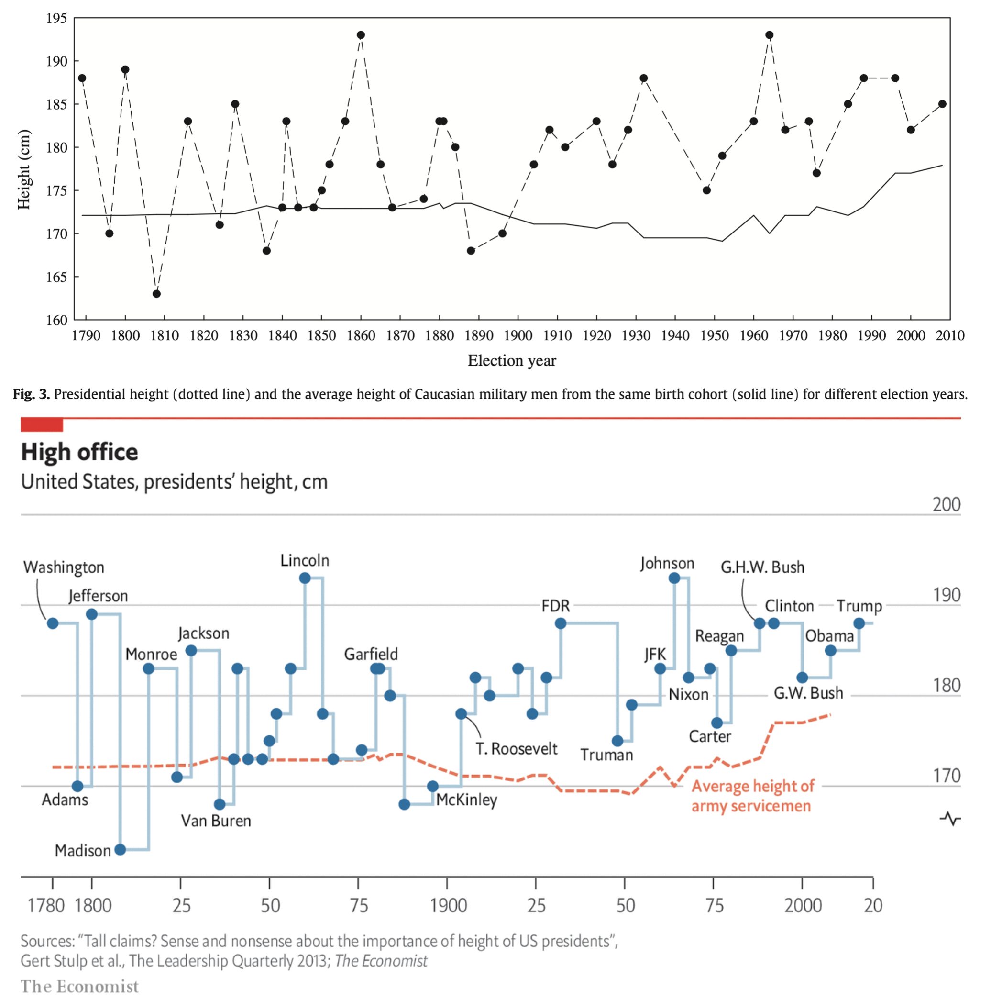

Given the upcoming US elections, several media outlets have shown interest in my research on [US presidential height](https://www.gertstulp.com/publication/2013_stulp_et_al_tlq_presidents/). So did The Economist: https://www.economist.com/graphic-detail/2020/02/19/in-politics-height-matters.

They definitely improved my graphs: 

I should try and see if I can recreate those graphs in **R**.
