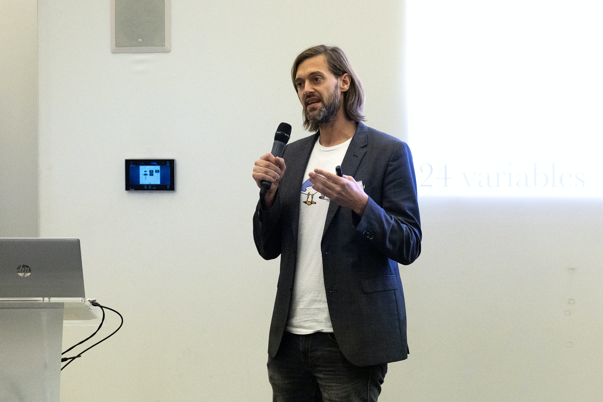
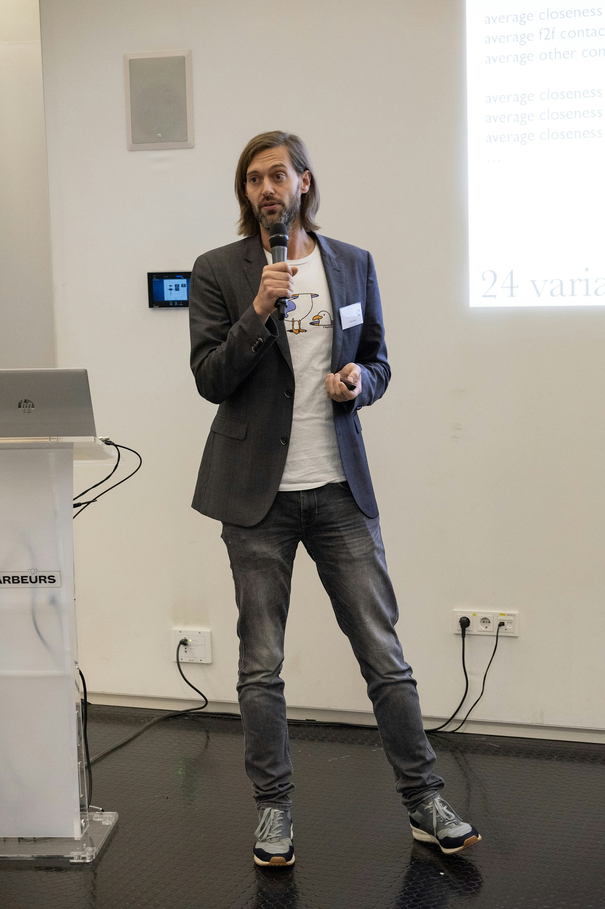

## Summary 
 
 &nbsp;&nbsp;&nbsp;&nbsp; ODISSEI lecture

 &nbsp;&nbsp;&nbsp;&nbsp; Rotterdam, the Netherlands

 &nbsp;&nbsp;&nbsp;&nbsp; Click [here](https://odissei-data.nl/nl/2023/10/odissei-lezing-how-predictable-are-fertility-outcomes-introducing-the-prefer-data-challenge-and-its-potential-for-fertility-research/) for website

 &nbsp;&nbsp;&nbsp;&nbsp; Download materials [here](/pdf/ODISSEI_PreFer_Gert_Stulp.pdf)

 &nbsp;&nbsp;&nbsp;&nbsp; There is a [video!](https://eur.cloud.panopto.eu/Panopto/Pages/Viewer.aspx?id=addbcfb3-2803-4ad7-a175-b0d600f80a92)

## Description

In a data challenge, (teams of) researchers using the same dataset try to best predict a particular outcome. In several fields like computer vision, natural language processing, and healthcare, prediction data challenges led to substantial progress both in model development and problem understanding. However, data challenges and the focus on predictability are still rare in the social sciences. 

In this talk, we present the Predicting Fertility data challenge (PreFer), a collaborative effort between the University of Groningen, ODISSEI, Eyra, and Centerdata, and the first data challenge in demography. Its central goal is to establish the current predictability of fertility outcomes – whether people have children – using two unique datasets: the LISS panel, a Dutch longitudinal survey, and Dutch population registry data. 

We will discuss the design of the data challenge and how this data challenge can produce novel and robust insights into an important life outcome and advance fertility research. The challenge will be open to any interested (team) of researchers and during the talk we will also provide practical details (timeline, data, evaluation, etc.) for those who are interested in joining it.  

If you’d like to learn more about PreFer and to be notified when the registration for the challenge opens, please send an email!

Here are pictures of me presenting with my old face:

